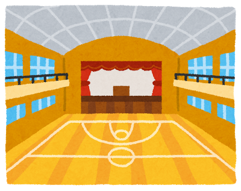

# 箇条書き
 - item1
 - item2
 - item3
 - [Ctrl]+[Shift]+[M]キー

もうひとつの大見出し
==

中見出し
---

## h2タグのタイトル

### h3小見出し

###### h6まで使える


hello.  
hello. hello. hello. hello.
hello. hello. hello. hello. hello.

改行だけでは改行にならない。改行スペース2つ以上いれると  
改行になる。

hello. hello. hello. hello. hello.
hello. hello. hello. hello.

# 引用  
 > quote. quote. quote. quote. quote.  
 quote. quote. quote. quote.   

## 引用とは  
他の著作者の一部を抜粋して、それについて述べたりすること。本文と明確に異なる書式にする。

# 区切り線

---

***

___

- - -

上に行があるとH2になってしまう
---

# 強調表現  
普通 *強調*  普通

normal _kyouchou_ normal

普通**強調２**普通

normal**kyouchou**normal

普通__強調２__普通

# 箇条書き
- item1
- item2

   段下げした状態で記載できる。前後に空行を入れて、4つ半角スペースを入れる。

- item3

# 連番リスト
1. 数字、ドット、スペース
2. 数字は何でもよい
5. これでも3になる
1. よくやるのは **すべてに1.** にする

# リンク
<http://datinstall.com>


http://datinstall.com

[リンクの文字](http://datinstall.com)

[ホバー](http://datinstall.com "ドットインストール")

利用したアセットへのリンクなどで活用するとよい。

# コードを見やすく

function x() {
  return x;
}

```
// [shift]+[@]キー
function x() {
  return x;
}
```

文章内でコードをあらわす場合、`function`などと書く。

```javascript
function x() {
  return x;
}
```

バッククォート３つの後ろに言語を現すつづりを書くと、その言語のハイライトが行われる。c#ならcs、HTMLならhtml。c言語ならc


# 箇条書きのインデント
- 箇条書き
  - スペース2つで箇条書きで、段下げ
    - スペース4つでさらに下げる
  - 1段戻す
- 元に戻る

1. 連番も同様
     1. 下げる
     1. 下げる
1. 戻す

# 画像


- ALT属性とは、画像が所得できなかったり、非表示のときに、代わりの表示される文字列


## 画像にリンク
[](http://dotinstall.com)

リンクと画像を組み合わせたもの、ブラケット内に、画像のマークダウンを書いて、()内にリンク先のURLを書く。

## マークダウンファイルと同じ場所の画像のリンク
- [いらすとや](http://irasutoya.com/)
- いらすとやで適当な画像を2回ほどクリックして、画像だけ表示されるようにする
- 画像を右クリックして、[名前をつけて画像を保存]を選択して、デスクトップに保存


